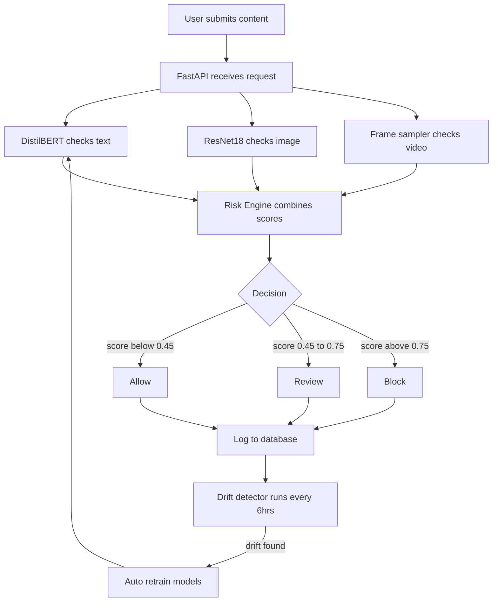
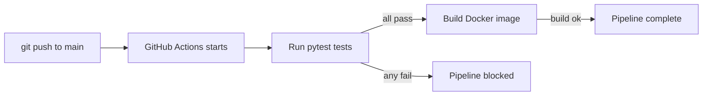
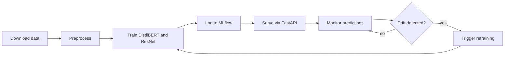

# 🚀 Real-Time Multimodal Content Moderation System with MLOps and CI/CD Pipeline


> **Production-grade multimodal content moderation system with DistilBERT-based text detection, MobileNetV2/ResNet computer vision, MLOps pipelines, CI/CD automation, model monitoring, drift detection, and continuous retraining loop.**

---

## 📖 Table of Contents
- [Project Description](#-project-description)
- [System Analogy 🎭](#-system-analogy-)
- [System Architecture](#-system-architecture)
- [CI/CD Pipeline](#-cicd-pipeline)
- [MLOps Continuous Loop](#-mlops-continuous-loop)
- [Models Used](#-models-used)
- [Tech Stack](#-tech-stack)
- [Folder Structure](#-folder-structure)
- [Setup & Installation](#-setup--installation)
- [Running the System](#-running-the-system)
- [API Endpoints & Usage](#-api-endpoints--usage)
- [MLflow Tracking](#-mlflow-tracking)
- [Monitoring & Drift Detection](#-monitoring--drift-detection)
- [CI/CD in Action](#-cicd-in-action)
- [Future Improvements](#-future-improvements)
- [Resume One-Liner](#-resume-one-liner)

---

## 🎯 Project Description

**What it does:** This system moderates user-generated content in **real time** across three modalities — **text, images, and video**. It uses fine-tuned transformer and CNN models to score content for toxicity, violence, or policy violations, makes an **allow/review/block** decision, logs every prediction, monitors for data drift, and automatically triggers **continuous retraining** when model performance degrades.

**Why it matters:** Online platforms receive billions of content pieces daily. Manual moderation doesn't scale, and static models become outdated as language and user behavior evolve. This system closes the loop between **prediction, monitoring, feedback, and retraining** — enabling self-healing AI moderation.

**Key capabilities:**
- ⚡ Sub-100ms inference per text/image on CPU
- 🎥 Video frame sampling with temporal smoothing
- 📊 Real-time monitoring metrics (block rate, latency, drift)
- 🔁 Automatic retraining triggered by drift detection
- 🧪 Human-in-the-loop feedback for continuous improvement

---

## 🎭 System Analogy (Nightclub Bouncer)

Imagine a high-end nightclub with **one head bouncer** and **three specialized assistants**:

| Assistant | Real-World Role | AI Equivalent |
|-----------|----------------|----------------|
| **ID Checker** | Checks if someone is banned or causing past trouble | Text moderation (past toxic comments, hate speech) |
| **Appearance Checker** | Looks for prohibited attire, offensive symbols | Image classification (violence, nudity, gore) |
| **Behavior Watcher** | Observes how someone acts over 10-30 seconds | Video analysis (aggressive gestures, repeated violations) |

**The Bouncer (Risk Scoring Engine)** combines all three scores, applies rules (e.g., "If any score > 0.9 → BLOCK"), and decides: **Allow entry**, **Review with manager**, or **Block immediately**.

**The Security Log (Monitoring)** records every decision, tracks how often blocks happen, and alerts if suddenly 50% more people are blocked (drift).

**The Weekly Training (Retraining Loop)** takes feedback from wrong decisions and updates the assistants' playbooks.

---

Diagram 1 — Full system architecture (how a request flows from input to decision):


## System Flow



---

## CI/CD Pipeline



---
##Diagram 2 — CI/CD pipeline (what happens every time you push code to GitHub):


## MLOps Loop



##Diagram 3 — MLOps closed loop (how the system keeps improving itself automatically):


---

## Models

| Model | Job | Trained On |
|-------|-----|------------|
| DistilBERT | Detects toxic text | Google Civil Comments 1.8M rows |
| ResNet18 | Detects unsafe images | CIFAR-10 60K images |
| Frame Sampler | Checks video safety | Reuses ResNet18 on frames |

---
##Diagram 4 — Model comparison (DistilBERT vs ResNet vs Frame sampler side by side):


## Tech Stack

| Category | Tools |
|----------|-------|
| Language | Python 3.11 |
| ML Models | PyTorch, HuggingFace Transformers |
| Computer Vision | OpenCV, torchvision, Pillow |
| API Server | FastAPI, Uvicorn |
| MLOps | MLflow, DVC |
| Deployment | Docker, GitHub Actions |
| Monitoring | SQLite, custom drift detector |
| Testing | pytest |

---

## Project Structure
content-moderation-system/
├── .github/workflows/ci-cd.yml
├── docker/Dockerfile
├── models/
│   ├── text/distilbert_moderation.pt
│   └── image/resnet_moderation.pt
├── src/
│   ├── api/
│   │   ├── main.py
│   │   ├── model_loader.py
│   │   ├── predictor.py
│   │   └── risk_engine.py
│   ├── data/
│   │   ├── download_data.py
│   │   ├── preprocess_text.py
│   │   ├── preprocess_image.py
│   │   └── run_pipeline.py
│   ├── models/
│   │   ├── train_text.py
│   │   ├── train_image.py
│   │   └── video_sampler.py
│   └── monitoring/
│       ├── monitor.py
│       └── retrain_trigger.py
├── tests/
│   ├── test_api.py
│   └── test_risk_engine.py
└── requirements.txt

---

## How to Run

```bash
# 1. Clone the repo
git clone https://github.com/Poorvi-5/content-moderation-system.git
cd content-moderation-system

# 2. Create virtual environment
python -m venv venv
venv\Scripts\activate

# 3. Install dependencies
pip install -r requirements.txt

# 4. Download and process data
python src/data/run_pipeline.py

# 5. Train models
python -m src.models.train_text
python -m src.models.train_image

# 6. Start the API
python -m uvicorn src.api.main:app --reload --port 8000
```

Open `http://localhost:8000/docs` to test all endpoints.

---

## API Endpoints

| Method | Endpoint | What it does |
|--------|----------|--------------|
| GET | /health | Check if server is running |
| POST | /moderate/text | Moderate a text string |
| POST | /moderate/image | Moderate an image file |
| POST | /moderate/video | Moderate a video file |
| POST | /moderate/all | Moderate all three at once |
| GET | /monitoring/metrics | See prediction stats |
| GET | /monitoring/drift | Check for model drift |
| POST | /monitoring/feedback | Submit human feedback |

---

## Example Request

```bash
curl -X POST http://localhost:8000/moderate/text \
  -H "Content-Type: application/json" \
  -d '{"text": "I love this project!", "user_id": "user1"}'
```

Response:
```json
{
  "decision": "allow",
  "risk_score": 0.03,
  "reason": "risk score 0.03 within acceptable range",
  "modality_scores": {"text": 0.03},
  "latency_ms": 42.1
}
```

---

## View MLflow Dashboard

```bash
mlflow ui
```
Open `http://localhost:5000` to see all training runs, metrics, and model artifacts.

---

## Run Tests

```bash
python -m pytest tests/ -v
```

---

## Resume One-Liner

> Built a production-grade multimodal content moderation system with DistilBERT fine-tuning for text toxicity detection, ResNet18 for image classification, FastAPI serving, Docker containerization, GitHub Actions CI/CD, MLflow experiment tracking, automated drift detection, and continuous retraining loop.

---

## License

MIT License

---

*Built as a production-grade ML portfolio project*

    style INPUT fill:#e1f5fe
    style CONFIG fill:#fff3e0
    style TRAINING fill:#f3e5f5
    style TRACKING fill:#e8f5e9
    style OUTPUT fill:#e0f2f1
